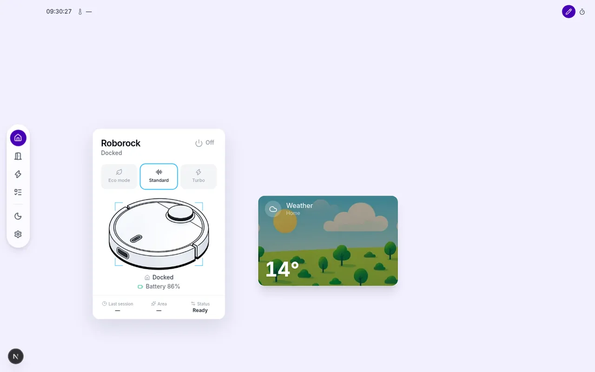
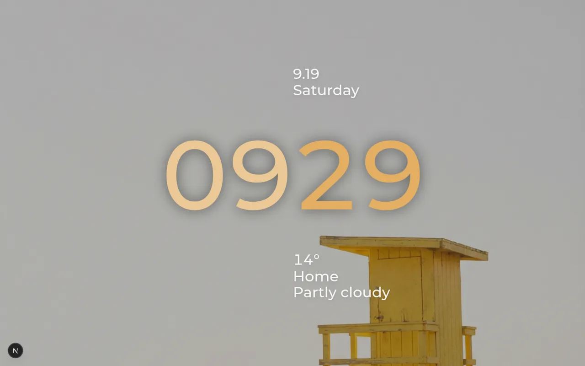
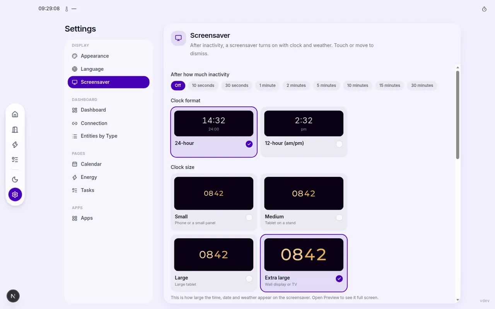
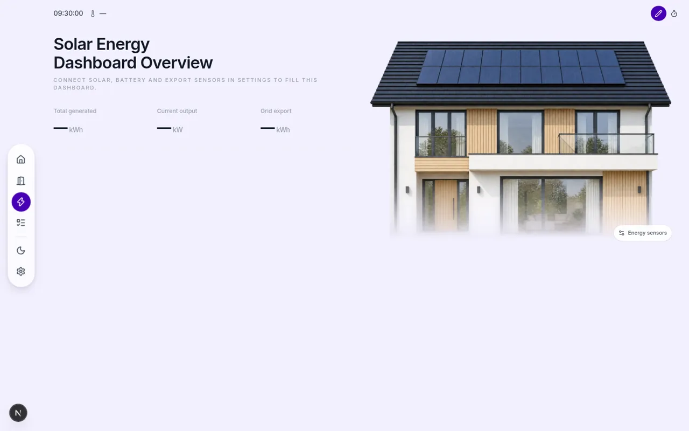

# Home Assistant Dashboard Builder

A personal, touchscreen-friendly dashboard for Home Assistant. Add widgets, set backgrounds, manage rooms, track energy, and more — all without writing code.

The interface is available in **English** and **Dutch**.



<p>


</p>



---

## What's new

Recent updates that landed on `main`:

- **Screensaver lock clock** — Montserrat Medium, hours and minutes side by side in warm gold (hours slightly paler), with a tint from your accent color. Four sizes from phone to wall display; Extra large is meant for a TV or wall tablet.
- **Music on the screensaver** — choose which Home Assistant `media_player` may show now-playing. Automatic (first player that is playing), a specific speaker, or hide music entirely. Useful when some speakers report playback but do not pass a real track.
- **Vacuum card** — restyled around light/dark robot illustrations, with a full control sheet (and Valetudo map when configured).
- **Resizable cards** — Media, Weather, Climate, and Vacuum cards scale from a bottom-right handle in edit mode, same as each other.
- **Swipeable Home pages** — up to six dashboard pages, swiped like the Rooms floors.
- **Screensaver media** — custom upload, [Pexels](https://www.pexels.com/api/), or your own [Immich](https://immich.app/) library.
- **Voice Satellite** — tap-to-talk Assist from the header, or an on-device wake word (Okay Nabu, Hey Jarvis, and others). Uses your Home Assistant voice pipeline for speech-to-text, conversation, and spoken replies.

---

## Features

### Home & rooms

- Free-form dashboard: drag cards, optional edit passcode, welcome title, and a wallpaper per light/dark theme.
- Up to six swipeable Home pages.
- Rooms grouped by floor; swipe between floors, then open a room board with the same editor.

### Cards

Add tiles in edit mode. Current types:

| Card | Notes |
|---|---|
| Light | Brightness, color, and color temperature |
| Climate | Temperature gauge; swipe between climate entities |
| Media | Now playing; resizable |
| Weather | Current conditions; tap for hourly/weekly forecast; resizable |
| Vacuum | Robot illustration and control sheet; resizable |
| Calendar | Compact Now / Up next |
| Tasks | Family chore summary |
| Room | Shortcut into a room |
| Text / Image / Stat pill | Labels, photos, and single-value stats |

### Screensaver

After idle time the dashboard becomes a lock screen. Dismiss it with a tap or mouse move.

- Clock size and position (nine placements), 12- or 24-hour format, and a full-screen preview from Settings.
- Weather (same entity as the header, or a specific one).
- Now-playing from a chosen speaker, or hidden.
- Optional football match overlay from a `sensor.team_…` entity.
- A running kitchen timer stays visible on the lock screen.
- Background: uploaded image, Pexels photos/videos, or Immich photos/videos.

Configure this under **Settings → Screensaver**.

### Pages

Enable extra pages in Settings when you need them:

| Page | What it does |
|---|---|
| **Energy** | Solar/grid/battery overview, house scene, panel heatmap, and an editable energy board |
| **Calendar** | Day / week / month, Today, Now, and Up next from Home Assistant calendars |
| **Family / Tasks** | Children, chores, points, streaks, and a rewards shop — works **without** Home Assistant |
| **Music** | Music Assistant home (search, shelves, player) or a Home Assistant media-player fallback |
| **Vacuum** | Full-page Valetudo map and room cleaning (from Settings → Apps → Valetudo, or the vacuum card) |

The header also shows the clock, weather temperature, optional RSS news, a timer, Voice Satellite, and now-playing.

### Settings & integrations

- **Appearance** — light / dark / system theme and accent color.
- **Connection** — Home Assistant base URL and long-lived access token.
- **Apps** — Music Assistant, Valetudo, Pexels, Immich, RSS news, and Voice Satellite (Home Assistant Assist, optional wake word).

---

## Quick install with Docker

The easiest way to run the dashboard is with the pre-built Docker image from GitHub Container Registry.

```bash
docker run -d \
  --name ha-dashboard \
  --restart unless-stopped \
  -p 3000:3000 \
  -v ha-dashboard-data:/data \
  -e APP_SECRET="change-this-to-a-random-32-char-secret" \
  ghcr.io/hiddevanbrussel/dashboard-home-assistant:latest
```

Open **http://your-server-ip:3000** and follow the onboarding to connect Home Assistant.

---

## Docker Compose

Create a `docker-compose.yml`:

```yaml
services:
  ha-dashboard:
    image: ghcr.io/hiddevanbrussel/dashboard-home-assistant:latest
    container_name: ha-dashboard
    restart: unless-stopped
    ports:
      - "3000:3000"
    volumes:
      - ha-dashboard-data:/data
    environment:
      - APP_SECRET=change-this-to-a-random-32-char-secret
      - PEXELS_API_KEY=        # optional — get a free key at pexels.com/api

volumes:
  ha-dashboard-data:
```

```bash
docker compose up -d
```

---

## Unraid

1. In Unraid, go to **Apps** and click **Add Container** (or import a template).
2. Set the repository to:
   ```
   ghcr.io/hiddevanbrussel/dashboard-home-assistant:latest
   ```
3. Map port **3000** and set a host path for `/data` (e.g. `/mnt/user/appdata/ha-dashboard`).
4. Add the environment variable `APP_SECRET` with a random string.
5. Optionally add `PEXELS_API_KEY` for screensaver photos/videos.

You can also import the template from the repository: [`unraid-template.xml`](unraid-template.xml)

---

## Connecting Home Assistant

You need a **Long-Lived Access Token** from Home Assistant:

1. Open Home Assistant → click your **Profile** (bottom-left avatar).
2. Scroll to **Long-Lived Access Tokens** → click **Create token**.
3. Give it a name (e.g. "Dashboard") and copy the token — it is shown only once.

Enter the token and your Home Assistant base URL during onboarding:

| Setup | URL example |
|---|---|
| Local hostname | `http://homeassistant.local:8123` |
| IP address | `http://192.168.1.10:8123` |
| HTTPS / reverse proxy | `https://ha.yourdomain.com` |

---

## Environment variables

| Variable | Required | Description |
|---|---|---|
| `APP_SECRET` | Yes | Random secret for session encryption (min. 32 characters) |
| `DATABASE_URL` | No | SQLite path (default: `file:/data/app.db`) |
| `PEXELS_API_KEY` | No | Free key from [pexels.com/api](https://www.pexels.com/api/) for screensaver media |
| `NEXT_PUBLIC_APP_NAME` | No | App name shown in the browser title |
| `NEXT_PUBLIC_DEFAULT_LANGUAGE` | No | Default UI language: `en` (English) or `nl` (Dutch) |

---

## Automatic updates

The Docker image is rebuilt automatically on every push to `main` and on every version tag (`v*.*.*`). To update:

```bash
docker pull ghcr.io/hiddevanbrussel/dashboard-home-assistant:latest
docker compose up -d   # or restart the container in Unraid
```

The current version is shown in **Settings → System**.

---

## Troubleshooting

**Invalid token** — Create a new Long-Lived Access Token in Home Assistant and enter it in Settings → HA Connection.

**Mixed content warning** — If the dashboard runs on HTTPS, the Home Assistant URL must also be HTTPS (or use a reverse proxy).

**Can't reach Home Assistant** — All HA API calls are made server-side. The HA URL must be reachable from the Docker container, not just from your browser.

**Uploads not persisting** — Make sure the `/data` volume is mounted. Without it, uploaded images and the database are lost when the container restarts.

---

## Build from source

```bash
git clone https://github.com/HiddevanBrussel/Dashboard-Home-Assistant.git
cd Dashboard-Home-Assistant
npm install
cp .env.example .env   # edit APP_SECRET
npx prisma migrate dev
npm run dev            # http://localhost:3000
```

```bash
npm run build && npm run start   # production
```
